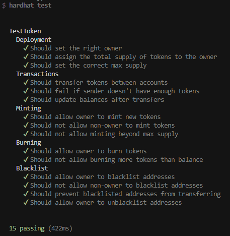

# hardhat-viem

This project implements an ERC20 token with a Fastify API backend using Viem for blockchain interactions.

## Prerequisites

- Node.js (v22.x)
- npm or yarn
- Hardhat
- Docker (optional, for Blockscout explorer)

## Installation

1; Clone the repository:

```bash
git clone https://github.com/yerofey/hardhat-viem.git
cd hardhat-viem
```

2; Install dependencies:

```bash
npm install
```

## Configuration

Create a `.env` file in the root directory with the following variables:

```bash
PRIVATE_KEY=your_private_key_here
TOKEN_ADDRESS=your_token_address_here
PORT=3000
```

## Usage

### 1. Start Local Hardhat Network

In one terminal:

```bash
npm run hardhat:node
```

This will start a local Hardhat network and display a list of test accounts with their private keys.

### 2. Deploy the Token Contract

In another terminal:

```bash
npm run hardhat:compile
npm run hardhat:deploy
```

Save the token address that gets printed in the console and update it in your `.env` file.

### 3. Start the API Server

In a new terminal:

```bash
npm start
```

The API will be available at `http://localhost:3000`

## API Endpoints

### Token Info

- `GET /token-info` - Get token name, symbol, and total supply
- `GET /max-supply` - Get maximum token supply
- `GET /balance/:address` - Get token balance for an address

### Token Operations

- `POST /transfer` - Transfer tokens from one address to another
- `POST /mint` - Mint new tokens (owner only)
- `POST /burn` - Burn tokens
- `POST /blacklist` - Blacklist an address (owner only)
- `POST /unblacklist` - Remove address from blacklist (owner only)
- `GET /is-blacklisted/:address` - Check if address is blacklisted

### Example API Usage

```bash
# Get token info
curl http://localhost:3000/token-info

# Get balance
curl http://localhost:3000/balance/0x123...

# Transfer tokens
curl -X POST http://localhost:3000/transfer \
  -H "Content-Type: application/json" \
  -d '{"from": "0x123...", "to": "0x456...", "amount": "1000000000000000000"}'

# Mint tokens
curl -X POST http://localhost:3000/mint \
  -H "Content-Type: application/json" \
  -d '{"to": "0x123...", "amount": "1000000000000000000"}'
```

## Testing

Run the test suite:

```bash
npm test
```

All tests should pass.



## License

[MIT](LICENSE.md)
